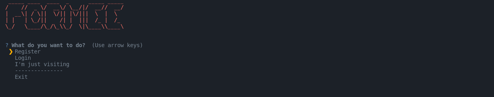

# Getting Started with the CLI
Getting up and running with the CLI is easy. You can use the following steps to get started:

## First install the CLI

Install the CLI with pip or Github repository.

Instructions can be found in the [Installation](/installation.html) section.

## Then run the command

```bash
python3 -m formee
```

Or just

```bash
formee
```
## Then you're good to go.
You will see the following output:



