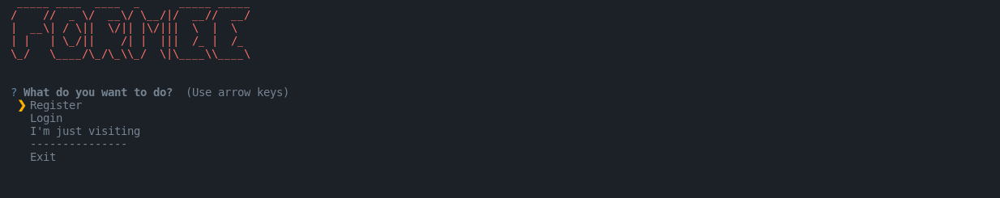
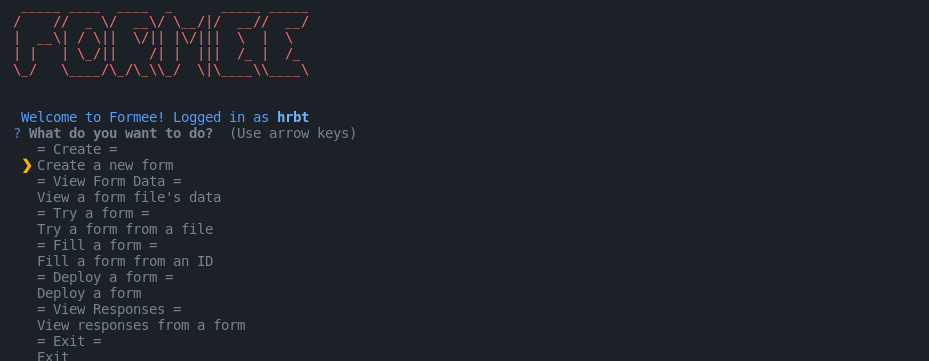

# Authentication

You will need to authenticate to be able to deploy the forms to web. You can still use the CLI to create forms and fill them, but you will need to authenticate to be able to deploy them to the web or access responses. When you run the CLI for the first time, you will be prompted to authenticate. There will be 3 options to choose from:

1. **Login**: You will be prompted to enter your username and password.
2. **Register**: You will be prompted to enter your username and password to create an acoount.
3. **I'm just visiting**: You can explore the CLI and fill, create forms.

Logging in will create a `formee.yml` in your home directory. This file will contain your username and password. This file is used to authenticate you when you run the CLI again and should only be deleted if you want to log out.

> **Note:** The username and password are case sensitive and cannot be changed, atleast currently. If you want to change the password, you will need to contact the administrator.

