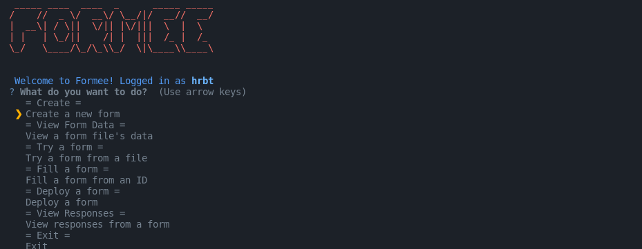

# Creating A Form

Forms in formee are represented by a YAML file. The YAML file is a simple text file that contains a list of questions, their type and other details. When you create a form, you will be prompted to enter the name of the form and the path to the YAML file.

Steps:
1. Enter the name of the form.
2. Enter the description of the form.
3. Enter the first question.
4. Enter the type of the question.
    
    This can be one of the following (we are working on more types):
    * Text
    * Number
    * Confirmation
    * Options 
    
5. Enter the options for the question (If you chose the type `options`).
6. Tell if the question is required or not.
7. Answer prompt if you want to add more questions.
8. Then repeat steps 3-7.
9. When you are done, the tool will create a YAML file in the current directory. This file will be used to `deploy` the form.