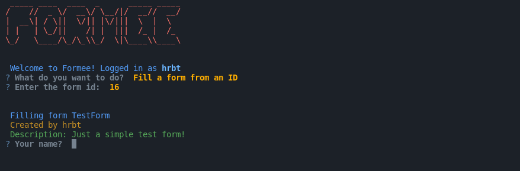
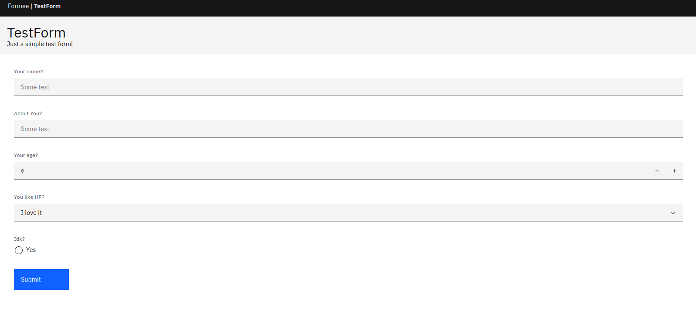

# Filling a Form

# From the CLI
After a form is deployed, you can fill it from the CLI too. During a deployment, an ID is generated for the form. This ID is used to fill the form. You can fill the form by entering the ID and the answers to the questions.

# From the Web
You can also fill the form on the web by visiting [https://formee.hackersreboot.tech/form/{form_id}](https://formee.hackersreboot.tech/form/{form_id}).

For example, to fill the form with ID `16` just go to [https://formee.hackersreboot.tech/form/16](https://formee.hackersreboot.tech/form/16).

This feature is available only for the deployed forms and has been added to allow you to get responses from others without all needing a CLI. Also, the form's UI is developed using [IBM's Open-Source Carbon Design System](https://carbondesignsystem.com).