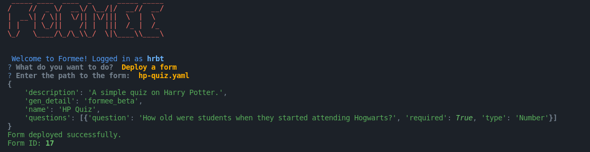

# Deploying A Form

> **Login Required**

We can deploy the form from the YAML file that we created earlier. This form is deployed on our database. We can now fill the form from the CLI or the web. 

1. To deploy a form, we need to use the `formee` command. Then Select the `Deploy a form` option.
2. Enter the file path of the YAML file that we created earlier.
3. The program will output the form data and start deployment.
4. The program will output the form ID.
5. This ID is used to fill the form.

