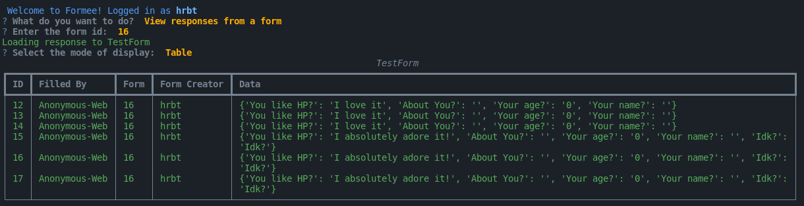
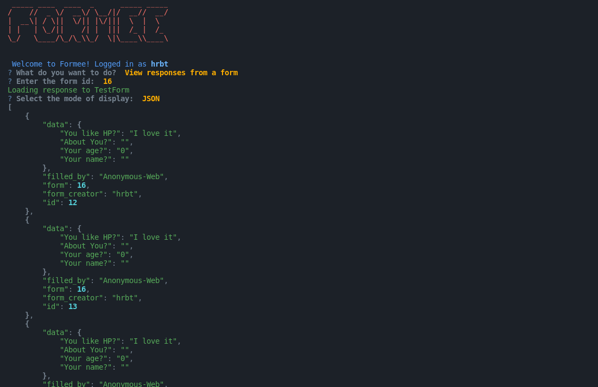

# Getting Responses to a form

Now, that we have a form deployed, we can get responses to it. We can get responses from the CLI by just selecting `View Responses from a form` in the action prompt.

1. Enter the form ID in the prompt.
2. Select the mode of the response.
    The following modes are available:
    - **Table**: This mode will display the responses in a table.
    - **JSON**: This mode will display the responses in JSON format.
    - **Write to JSON**: This mode will write the responses to a JSON File.
    - **Write to YAML**: This mode will write the responses to a YAML File.
3. The program will output the responses, if you are the owner of the form.

